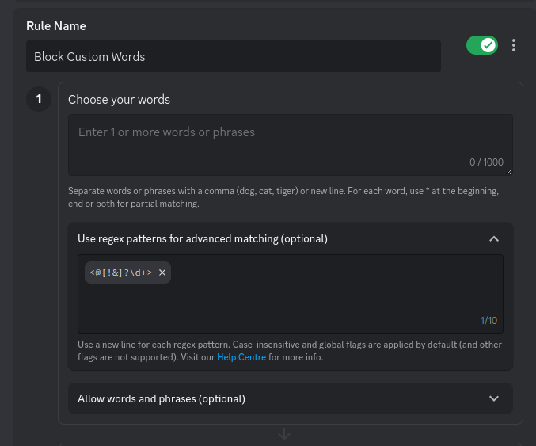

### If you want to block both User and Role Pings
`<@[!&]?\d+>` (Regex)

### If you want to just block User Pings
`<@!?\d+>` (Regex)

### If you want to just block Role Pings
`<@&\d+>` (Regex)

### If you want to block `@everyone` and `@here` pings
`@everyone,@here` (Normal)

### Example Setup

