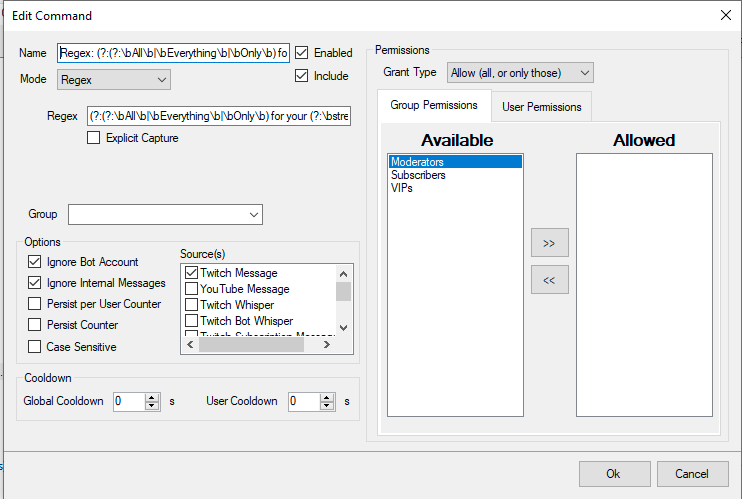

### Regex
`(?:(?:\bAll\b|\bEverything\b|\bOnly\b) for your (?:\bstream\b|\bchannel?\b).*(?:\bprimes?\b|\bviewers?\b|\bfollows?\b| ?(?:\w*\. ?\w*|\*\*\*))|.*(?:(?:\bchannels?\b|\bviewers?\b|\bviews?\b|\bf[o0]ll[o0]wers?\b|\bprimes?\b|\bchat b[o0]ts?\b|\bsubprimes?\b|\bfollows?\b|\bprimesubs?\b|\bbits?\b) ?,? ?)+ on \w+ *(?:\.|dot) *(?:\w|-|(?:\.|dot) ?)+|(?:\bBest\b|\bUpgrades\b|\bImprover?|.*\b[o0]ffer pr[o0]m[o0]ti[o0]n [o0]f\b|\bBewerben Sie\b|\bPromote\b) *(?:Ihren |your )?(?:(?:\bKanals?\b|\bchannels?\b|\bstreams?\b|\bviewers?\b|\bviews?\b|\bf[o0]ll[o0]wers?\b|\bprimes?\b|\bchat b[o0]ts?\b) ?,? ?)+|\bZuschauer für nur\b|\bhier ist (?:eine?)? ?Promo\b|\bstreamhub world\b)`

### Nightbot (-> Spam Protection -> Blacklist Word/Phrases):
`~/(?:(?:\bAll\b|\bEverything\b|\bOnly\b) for your (?:\bstream\b|\bchannel?\b).*(?:\bprimes?\b|\bviewers?\b|\bfollows?\b| ?(?:\w*\. ?\w*|\*\*\*))|.*(?:(?:\bchannels?\b|\bviewers?\b|\bviews?\b|\bf[o0]ll[o0]wers?\b|\bprimes?\b|\bchat b[o0]ts?\b|\bsubprimes?\b|\bfollows?\b|\bprimesubs?\b|\bbits?\b) ?,? ?)+ on \w+ *(?:\.|dot) *(?:\w|-|(?:\.|dot) ?)+|(?:\bBest\b|\bUpgrades\b|\bImprover?|.*\b[o0]ffer pr[o0]m[o0]ti[o0]n [o0]f\b|\bBewerben Sie\b|\bPromote\b) *(?:Ihren |your )?(?:(?:\bKanals?\b|\bchannels?\b|\bstreams?\b|\bviewers?\b|\bviews?\b|\bf[o0]ll[o0]wers?\b|\bprimes?\b|\bchat b[o0]ts?\b) ?,? ?)+|\bZuschauer für nur\b|\bhier ist (?:eine?)? ?Promo\b|\bstreamhub world\b)/gi`

### StreamElements (-> Spam filters -> Banned Words), Streamlabs (-> Cloudbot -> Mod Tools -> Word Protection -> Blacklist) or Fossabot (untested) (Moderation -> Blocked terms (There is a button to enable Regex whose text is `(.*)`)):
`(?:(?:\bAll\b|\bEverything\b|\bOnly\b) for your (?:\bstream\b|\bchannel?\b).*(?:\bprimes?\b|\bviewers?\b|\bfollows?\b| ?(?:\w*\. ?\w*|\*\*\*))|.*(?:(?:\bchannels?\b|\bviewers?\b|\bviews?\b|\bf[o0]ll[o0]wers?\b|\bprimes?\b|\bchat b[o0]ts?\b|\bsubprimes?\b|\bfollows?\b|\bprimesubs?\b|\bbits?\b) ?,? ?)+ on \w+ *(?:\.|dot) *(?:\w|-|(?:\.|dot) ?)+|(?:\bBest\b|\bUpgrades\b|\bImprover?|.*\b[o0]ffer pr[o0]m[o0]ti[o0]n [o0]f\b|\bBewerben Sie\b|\bPromote\b) *(?:Ihren |your )?(?:(?:\bKanals?\b|\bchannels?\b|\bstreams?\b|\bviewers?\b|\bviews?\b|\bf[o0]ll[o0]wers?\b|\bprimes?\b|\bchat b[o0]ts?\b) ?,? ?)+|\bZuschauer für nur\b|\bhier ist (?:eine?)? ?Promo\b|\bstreamhub world\b)`

### Streamer.Bot
`(?:(?:\bAll\b|\bEverything\b|\bOnly\b) for your (?:\bstream\b|\bchannel?\b).*(?:\bprimes?\b|\bviewers?\b|\bfollows?\b| ?(?:\w*\. ?\w*|\*\*\*))|.*(?:(?:\bchannels?\b|\bviewers?\b|\bviews?\b|\bf[o0]ll[o0]wers?\b|\bprimes?\b|\bchat b[o0]ts?\b|\bsubprimes?\b|\bfollows?\b|\bprimesubs?\b|\bbits?\b) ?,? ?)+ on \w+ *(?:\.|dot) *(?:\w|-|(?:\.|dot) ?)+|(?:\bBest\b|\bUpgrades\b|\bImprover?|.*\b[o0]ffer pr[o0]m[o0]ti[o0]n [o0]f\b|\bBewerben Sie\b|\bPromote\b) *(?:Ihren |your )?(?:(?:\bKanals?\b|\bchannels?\b|\bstreams?\b|\bviewers?\b|\bviews?\b|\bf[o0]ll[o0]wers?\b|\bprimes?\b|\bchat b[o0]ts?\b) ?,? ?)+|\bZuschauer für nur\b|\bhier ist (?:eine?)? ?Promo\b|\bstreamhub world\b)`

#### If you want to just delete the message:
Import the following Action if you want to just delete it:
```
TlM0RR+LCAAAAAAABAB1VFtvmzAYfZ+0/4Dy1ElLBIGQUGkPbdqQy0IVkuY2+mBsQ2gNZjaE0qr/fQYWFRIVCYG/c3y+Y+PD+/dvktQ6YsYDGrWupe7PshCBEItRq1UNAUwEzEXlTzGWpPfqIaAAFTwXAbUvA70NNB20NcMTb4YB212ou8qgL3toACutctLfFKeFfpQS8lnFEXAJLvQSluJa/RWSFOERo+E44AlluaB4gPAa52R4A6IISLcY0hBLIxDSlEtXd5jgBP+oGfAZTePPBZY1QDKQczuNLtUZiBANb8pduEQhjWDKGI6SS+xi5xq717BeuZSuhjTOa15LDsIcsiD+3791hr5gHN+Q4Igv+lfusYeFO4jPbJTg8NpxNoFYXsYdZx5ARjn1ko51v3KcERPWMspedM1xjlpH7qiyqhiOE3JIGQncDiKkVRd8anZ28wQPKSqXh7ZW7IbQf1TJGzLXyUMmz+4WcYY2Uw42c3/XfT1Ade4vlNvJctMTtR4ReP9uQadwvA5ckzxPzOnR7Wa+vT2QnbqW90s/LnAstIYLYahr8IKDhjfGxNwf3LFFHios329tBYZaqf+b2CrY2s/g3iauKXQeLbrb2tZ+a73tNojMzFG+Vy13Eipve5m8TIicrk1jhcbTYg10tsz8XWjIsxW3hj4xhE9x019n3yVmxTmMA/LFh0GYgHyZAHZ5cEqcgyO2MU9JsqJrwIIiHl8zG5zzI1LFVNH0PkIYtD1PhFMzBl4bqAOlrehogHp6T1dR92xihgP/UPiTO3ITSfK46GQUVxM5pasR7xL5IuKVxQjh16LRZ/Xj9Pp0niizaFGe56d6EAkBMceohlZgKVQxq59PbaqYFoYi4Cf+xz/8oTMkFAUAAA==
```

Example Configuration:



#### If you want to timeout the offender:
Create an Action and take Twitch->Moderation->TimeoutUser as Sub-Action (Make sure you have the Type set to `Redeemer`)

#### If you want to ban the offender:
Create an Action and take Twitch->Moderation->BanUser as SubAction (Use `%userName%` as userLogin)
